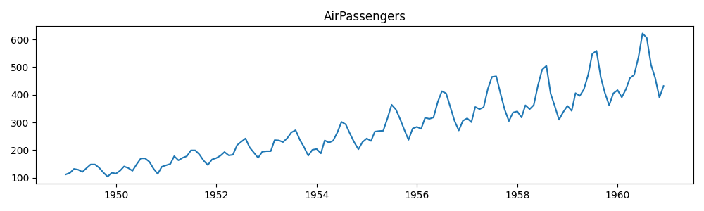
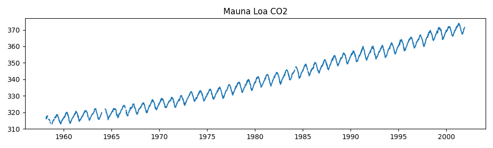
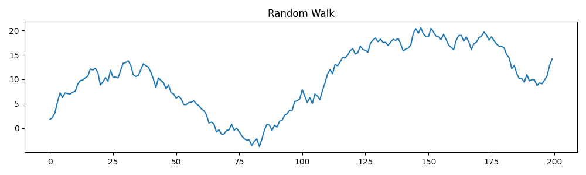
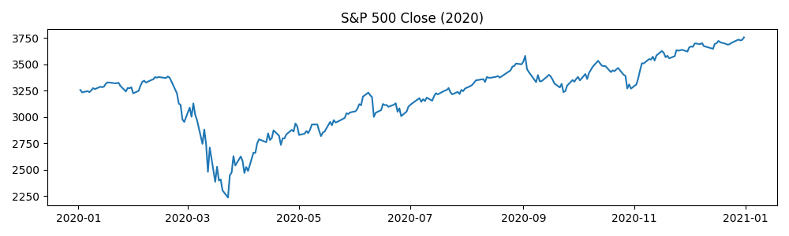
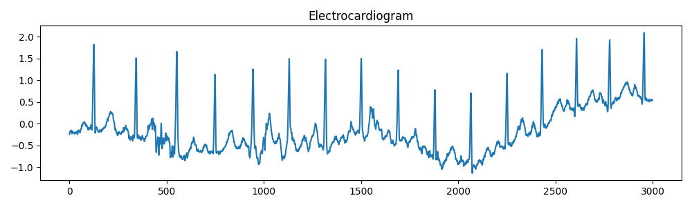

# Nature of Time Series {#sec-act1}

Time series data is a sequence of data points collected or recorded at successive points in time, typically at uniform intervals.
It is characterized by its temporal ordering, meaning that the order of the data points matters and can reveal patterns, trends, and seasonal variations over time.
Typically, time series data exhibits sequential dependencies, indicating that the value at a given time point may be influenced by previous values in the series.

Time series are not only used in industrial contexts, but also in various other fields such as finance, economics, environmental science, healthcare, and social sciences.

## Examples of Time Series Data

### Airline passenger numbers
This time series shows the monthly totals of international airline passengers from 1949 to 1960.
Source: [`RDatasets`](https://vincentarelbundock.github.io/Rdatasets/doc/datasets/AirPassengers.html) (accessed via `statsmodels`).



### Atmospheric CO2 concentrations
This time series shows the monthly average atmospheric CO2 concentrations measured at the Mauna Loa Observatory in Hawaii.
Source: [`statsmodels.datasets`](https://www.statsmodels.org/dev/datasets/generated/co2.html#source).



### Simulated Random Walk
Just a simulated random walk time series.
Code:
```python
import numpy as np

random_walk = np.cumsum(np.random.randn(200))
```



### S&P 500 index
This time series shows the daily closing prices of the S&P 500 in 2020.
Source: [Yahoo Finance](https://de.finance.yahoo.com/quote/%5EGSPC/) (downloaded via the `yfinance` package).



### Electrocardiagram (ECG) Signal
This time series represents an electrocardiogram (ECG) signal, which measures the electrical activity of the heart over time.
Source: [`scipy.misc.electrocardiogram`](https://docs.scipy.org/doc/scipy-1.13.0/reference/generated/scipy.misc.electrocardiogram.html).


